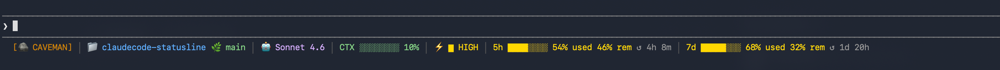

# claudecode-statusline

<p align="center">
  
</p>

A one-command setup for a richly decorated Claude Code statusline with [Caveman mode](https://github.com/JuliusBrussee/caveman) baked in. Interactive installer lets you pick all components or only the ones you want.

## What you get

```
[🪨 CAVEMAN] │ 📁 my-project 🌿 main │ 🤖 Claude Sonnet 4.6 │ CTX ████░░░░ 42% │ ⚡ ▄ MEDIUM │ 5h ████░░░░ 42% used 58% rem ↺ 1h 22m │ 7d ██░░░░░░ 85% used 15% rem ↺ 3d 7h
```

| Segment | Description |
|---|---|
| `🪨 CAVEMAN` | Active caveman mode (hidden when off) |
| `📁 project 🌿 branch` | Project folder name + git branch |
| `🤖 Claude Sonnet 4.6` | Current model name |
| `CTX ████░░░░ 42%` | Context window usage bar (green → yellow → red) |
| `⚡ ▄ MEDIUM` | Effort level with fill icon (only when model supports it) |
| `5h ████░░░░ 42% used 58% rem ↺ 1h 22m` | Hourly rate limit: spent + remaining % + time until reset |
| `7d ██░░░░░░ 85% used 15% rem ↺ 3d 7h` | Weekly rate limit: spent + remaining % + time until reset |

Rate limit bars use color-coded severity for both values:
- **Used %** — green (low) → yellow (mid) → red (high usage)
- **Rem %** — green (plenty left) → yellow → red (almost none left)

## Prerequisites

| Requirement | Install |
|---|---|
| [Claude Code](https://claude.ai/code) | Download from claude.ai/code |
| [Node.js](https://nodejs.org) LTS | `brew install node` / [nodejs.org](https://nodejs.org) |
| `bash` (Windows only) | [Git for Windows](https://git-scm.com) or WSL |

## Quick start

### macOS / Linux

```bash
git clone https://github.com/FahimFBA/claudecode-statusline.git
cd claudecode-statusline
chmod +x install.sh
./install.sh
```

Then restart Claude Code.

### Windows (PowerShell)

```powershell
git clone https://github.com/FahimFBA/claudecode-statusline.git
cd claudecode-statusline
powershell -ExecutionPolicy Bypass -File install.ps1
```

Then restart Claude Code.

## Interactive installer

When you run the installer it will ask:

```
How do you want to install?

  1) Full install  -- all components, replaces existing statusline
  2) Custom        -- choose which components to include

Choice [1/2, default=1]:
```

If you choose **2**, you'll see a numbered menu:

```
Available components:

  1) Caveman badge      🪨 CAVEMAN:FULL
  2) Project + branch   📁 my-project 🌿 main
  3) Model name         🤖 Claude Sonnet 4.6
  4) Context window     CTX ████░░░░ 42%
  5) Effort level       ⚡ ▄ MEDIUM
  6) Hourly limit (5h)  5h ████░░░░ 42% used · 58% rem ↺ 1h 22m
  7) Weekly limit (7d)  7d ██░░░░░░ 85% used · 15% rem ↺ 3d 7h
  8) Token savings      🪨 ~42% tokens saved

Numbers to include (e.g. 2 3 4 6 7), or 'all' [default=all]:
```

Enter the numbers you want separated by spaces. Your existing `statusLine` in `settings.json` is shown before you choose, so you can decide whether to replace it or build a custom one.

## What the installer does

1. Copies hook scripts to `~/.claude/hooks/`
2. Merges settings into `~/.claude/settings.json` (backs up existing file first)
3. Installs the Caveman plugin via `claude plugins install caveman --marketplace caveman`

Existing settings are **merged**, not overwritten — your other config survives.

## Caveman mode commands

| Command | Effect |
|---|---|
| `/caveman` | Activate full mode |
| `/caveman lite` | Lite mode (fewer drops) |
| `/caveman ultra` | Ultra compressed |
| `/caveman off` | Deactivate |
| `stop caveman` | Natural language deactivate |
| `/caveman-stats` | Token usage + savings this session |
| `/caveman-stats --all` | Lifetime stats across all sessions |

### Intensity levels

| Level | Behaviour |
|---|---|
| `lite` | Drop articles and filler, keep sentence structure |
| `full` | Fragments OK, short synonyms, caveman pattern |
| `ultra` | Maximum compression, minimal connectives |

## Files

```
claudecode-statusline/
├── hooks/
│   ├── caveman-activate.js      # SessionStart hook — activates caveman mode
│   ├── caveman-config.js        # Shared config resolver + safe flag I/O
│   ├── caveman-mode-tracker.js  # UserPromptSubmit hook — tracks mode changes
│   ├── caveman-stats.js         # Token usage stats engine
│   ├── caveman-statusline.sh    # Statusline renderer (bash)
│   └── package.json             # CommonJS marker
├── settings.template.json       # Reference settings (paths replaced by installer)
├── install.sh                   # macOS / Linux installer
├── install.ps1                  # Windows PowerShell installer
└── README.md
```

## Customising the statusline

Re-run the installer and choose option 2 to pick which components to show.

Or edit `~/.claude/hooks/caveman-statusline.sh` directly after install. The `append` function controls segment order — comment out any segment you don't want.

Each component can also be toggled via environment variables in the statusLine command (the installer writes these automatically when you use option 2):

| Env var | Default | Hides |
|---|---|---|
| `SL_CAVEMAN=0` | on | Caveman badge |
| `SL_PROJECT=0` | on | Project + branch |
| `SL_MODEL=0` | on | Model name |
| `SL_CTX=0` | on | Context window bar |
| `SL_EFFORT=0` | on | Effort level |
| `SL_5H=0` | on | Hourly rate limit |
| `SL_7D=0` | on | Weekly rate limit |
| `SL_SAVINGS=0` | on | Token savings |

To change caveman default mode, set the environment variable before starting Claude Code:

```bash
export CAVEMAN_DEFAULT_MODE=lite   # lite | full | ultra | off
```

Or create `~/.config/caveman/config.json`:

```json
{ "defaultMode": "lite" }
```

## Uninstall

Remove the hook scripts:

```bash
rm ~/.claude/hooks/caveman-*.js ~/.claude/hooks/caveman-statusline.sh
```

Remove the `hooks`, `statusLine`, `enabledPlugins`, and `extraKnownMarketplaces` keys from `~/.claude/settings.json`.

## Credits

- [Caveman plugin](https://github.com/JuliusBrussee/caveman) by JuliusBrussee — the underlying caveman mode engine
- Statusline and installer by [FahimFBA](https://github.com/FahimFBA)
